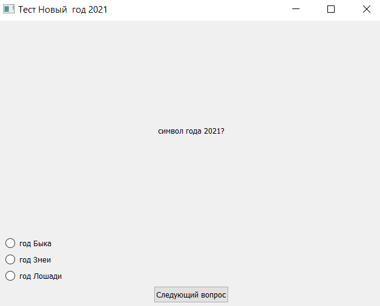
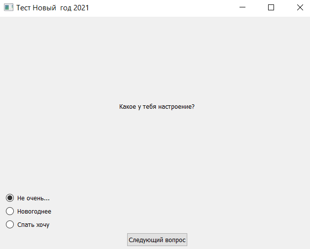
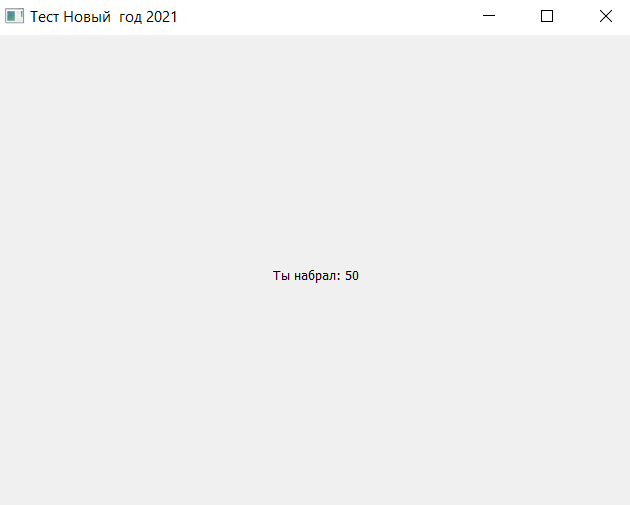

# Testing-Pyqt5
Hello everybody! This is my first project that i`ve done on Pyqt5. Thanks for Algoritmika, where i `ve learned everything that i know on python. If you want to do like this projects you can go to mars algoritmika and learn :D

